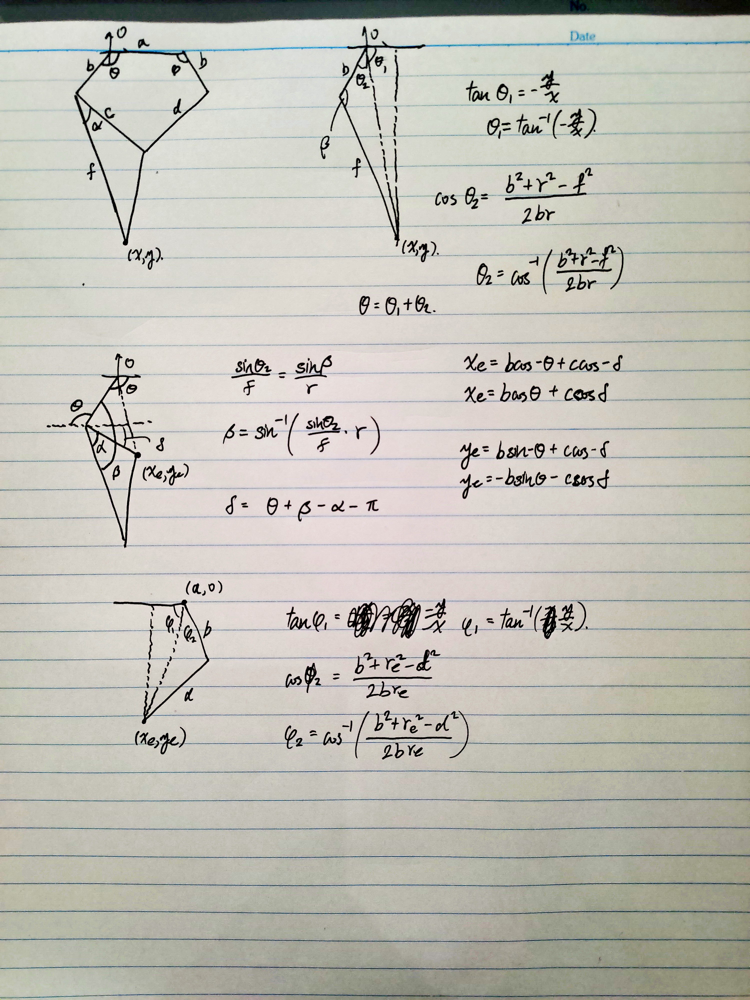

# MAEG2050 Project Group 1 (2020fall) 
## Project Proposal
[MAEG2050 proposal (Google Doc)](https://docs.google.com/document/d/1hGfzVqJj8J7EWmW0Pkdcsp7leIFFPUqpIvqRC-1Z36Q/edit)

## Note
- ~~Inverse Kinematics 17/10~~
- CAN bus comm
- Move motor using keyboard
- Calibrate
- Parameteized locus

## Inverse Kinematics 

